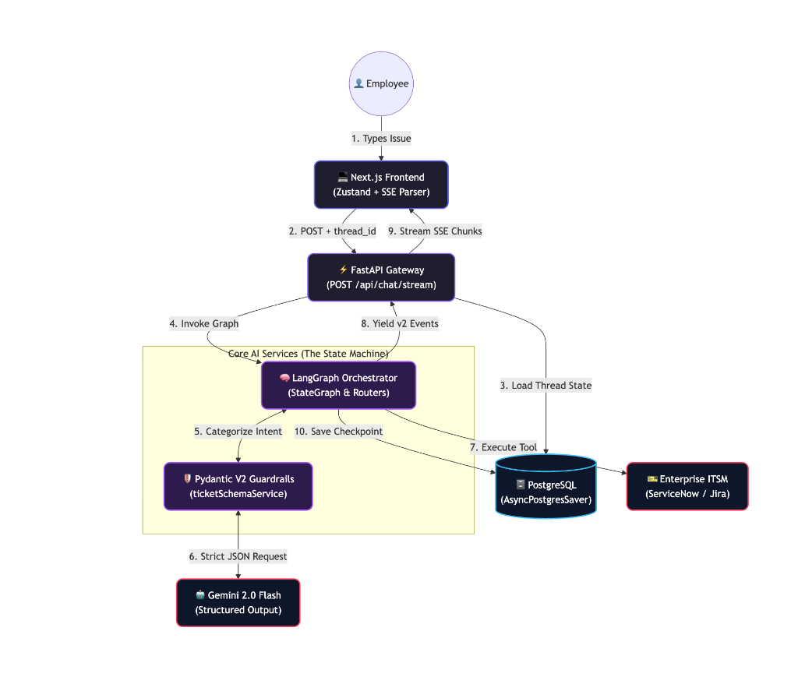
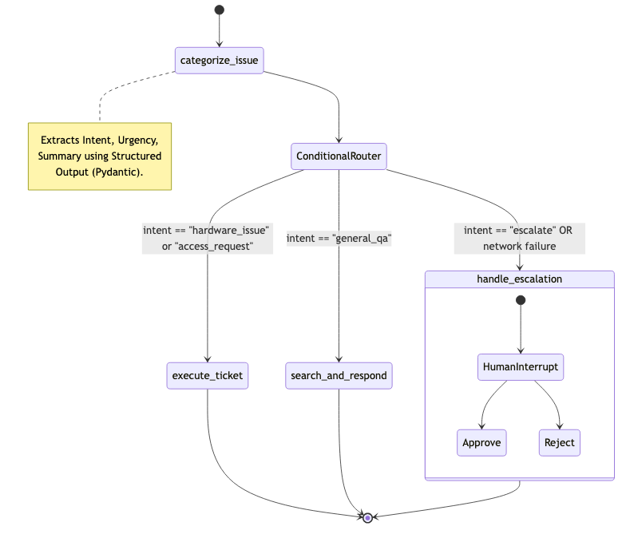

# TicketFlow - Agentic ITSM Orchestrator |

An Enterprise-Grade Agentic IT Helpdesk Accelerator, engineered over a reactive asynchronous stack utilizing LangGraph, FastAPI, and Next.js.

## Executive Summary
The Apexon AI Agent is a strict, autonomous triage system structured specifically for internal enterprise IT operations. Leveraging Groq LLM integrations, it achieves near-deterministic classification via strictly enforced Pydantic guardrails. The architecture implements native State Garbage Collection, ensuring only rigorously validated queries successfully write Checkpoint data into the PostgreSQL infrastructure, protecting Service Desk queues from hallucinated, non-IT tickets.

---

## High-Level Design Architecture (HLD)

The system relies on a tightly decoupled, three-tier architecture:
1. **Frontend**: A real-time Next.js application managing asynchronous Server-Sent Events (SSE). It features an asymmetrical, noise-textured brutalist UI strictly adhering to system fonts like Syne and DM Sans.
2. **Backend Services**: A FastAPI ASGI gateway managing the Uvicorn lifespan, exposing the endpoints to interface directly with LangGraph memory runnables.
3. **Data + Orchestration Layer**: A PostgreSQL robust datastore for concurrent thread-state persistence paired with a LangGraph state machine orchestrating `llama-3.3-70b-versatile` nodes.



---

## Agent Execution State Machine

Execution flow is governed by `agentGraphService.py`. Incoming directives traverse a directed graph to execute tools or safely garbage-collect invalid states.



### 1. Hard Triage (`categorize_issue`)
The primary ingress node invokes the LLM through `.with_structured_output()`. The LLM is locked securely to an `ITTicketExtraction` Pydantic schema enforcing cross-field validation rules (e.g., non-escalated issues cannot trigger a critical urgency trace). Few-shot prompting strictly anchors the LLM determinism, overcoming stochastic variation between "medium" and "low" predictions.

### 2. State Garbage Collection & Conditional Enforcer
The extracted `intent` is parsed synchronously through the `intent_router` edge.
- **`irrelevant` (Garbage Collection)**: Directives that fall outside IT domains are instantly routed to `reject_query`, violently wiping the `ticket_data` from state memory to prevent queue pollution.
- **`general_qa`**: Actionless inquiries are piped to a heavily sanitized `search_and_respond` KB integration.
- **`escalate`**: Issues flagged as complex or explicitly marked "critical" enter a Human-in-the-Loop (HITL) interrupt, halting graph execution.
- **`access_request` | `hardware_issue`**: Requests matching direct operations invoke `execute_ticket` to interface with the downstream ITSM.

### 3. Asynchronous Thread Recovery
Leveraging PostgreSQL checkpoint savers via `AsyncConnectionPool`, the agent automatically deduplicates user sessions dynamically fetching historical logs directly to the `<aside>` history panel in the frontend.

---

## Repository Conventions

**Architectural Law**: To ensure modular boundary validation, all files within this project strictly adhere to `camelCase` prefixes appending standard suffix types: `Service.py` (Backend logic), `FrontendComponent.tsx` (React views).

### Backend Specifications (Python + FastAPI)

| Module | Core Responsibility |
| ------ | ------- |
| **`mainAppService.py`** | The FastAPI entry point. Coordinates CORS and establishes the global application event lifespan. |
| **`dbConnectionCoreService.py`** | Manages the `psycopg_pool.AsyncConnectionPool` scaling. Attaches the LangGraph Checkpoint infrastructure directly into the application scope. |
| **`configCoreService.py`** | A static `@lru_cache` executing strict environment variable loads via Pydantic bindings. |
| **`ticketSchemaService.py`** | Central truth for all Pydantic V2 definitions governing intent schemas, fallback constraints, and LLM mapping boundaries. |
| **`agentStateService.py`** | The native LangGraph `ITAssistState` TypedDict, dictating exactly the payloads expected across edges. |
| **`agentNodesService.py`** | The pure node processing layer. Features `reject_query` GC interceptors and `handle_escalation` blockers. |
| **`agentGraphService.py`** | StateGraph compilation matrix. Declares nodes, conditional routers, edges, and establishes local HITL barriers. |
| **`chatApiRouteService.py`** | Endpoints encompassing POST operations triggering Graph workflows and streaming explicit SSE chunks. |
| **`test_agentNodes.py`** | Pytest cases designed to unit-test the prompt determinism against Groq and Langchain core dependencies. |
| **`test_apiRoutes.py`** | Pytest cases mocking explicit local routing endpoints leveraging HTTPX bindings. |

### Frontend Specifications (Next.js + React)

| Module | Core Responsibility |
| ------ | ------- |
| **`chatStoreService.ts`** | Core event bus driven by Zustand. Handles dynamic chunk parsing, local storage history persistence, and SSE byte conversion streams. |
| **`chatInterfaceFrontendComponent.tsx`** | A structurally brutalist, grid-breaking composition rendering individual `<TicketCard>` and `<StatusBubble>` abstractions based on the stream sequence. |

---

## System Initialization Protocols

### Requirements
- Python 3.11+
- Node.js 18+
- Docker Engine Configuration

### Bootstrapping Infrastructure
Construct a `.env` in the active project root adhering to strict schemas:
```env
DB_USER=
DB_PASSWORD=
DB_NAME=
DB_HOST=localhost
DB_PORT=5432
DATABASE_URL=
GROQ_API_KEY=YOUR_STATIC_GROQ_KEY
```

Initiate asynchronous PostgreSQL instance:
```bash
docker-compose -f dockerComposeService.yml up -d
```

### Application Runtime

**Node A (Backend Servers)**:
```bash
source .venv/bin/activate
uvicorn backend.mainAppService:app --reload --port 8000
```

**Node B (Web Servers)**:
```bash
cd frontend
npm install
npm run dev
```

Connect directly via API protocols at `http://localhost:3000`.
